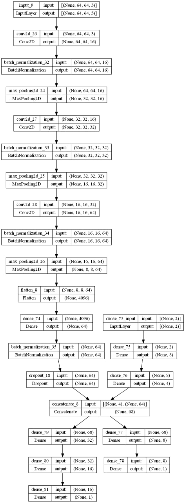
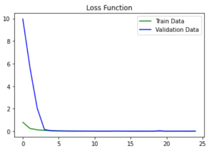

# Airfoil Lift Coefficient Prediction
Airfoil Lift Coefficients Prediction using Multi-input-output CNNs

## Contents
### Loading Dataset
Dataset is an excel file containing numerical features and images.

### Preparing and Cleaning Data
* Handling images missing data
* Handling wrong values
* Resizing images to (64, 64)

### Preprocessing Data
* Scaling
* Standardization

### Creating Model
Here is the model with two inputs (images and two numerical features) and two outputs (coefficients)
* 

### Evaluating Model
Total loss function (MSE)
* 

Additionally, r2 score for CL and CD predictions were 0.94 and 0.45 respectively.